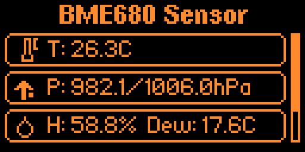

# 💨 BME680 Environmental Sensor Application for Flipper Zero

<h2 align="center">A Comprehensive Environmental Monitor for Flipper Zero</h2>

    <table style="width:100%; border:none;">
        <tr style="border:none;">
            <td style="border:none; padding:10px;">
                
                 
                <em>Główny ekran z pomiarami (Temp, Ciśnienie, Wilgotność)</em>
            </td>
            <td style="border:none; padding:10px;">
                
                 
                <em>Menu Ustawień (np. Adres I2C, Wysokość)</em>
            </td>
            <td style="border:none; padding:10px;">
                
                 
                <em>Ekran Legendy z objaśnieniem ikon</em>
            </td>
        </tr>
    </table>

---

This is a **comprehensive environmental monitoring application** designed for the **Flipper Zero** that interfaces with the high-precision **BME680 sensor** via **I2C**. The BME680 is a sophisticated environmental sensor capable of measuring **temperature, humidity, barometric pressure, and air quality (gas resistance)**.

## ✨ Features Overview

### 🌡️ Sensor Measurements

The application provides accurate and real-time readings for a full suite of environmental data:

* **Temperature:** Accurate temperature readings in Celsius ($\text{^\circ C}$).
* **Barometric Pressure:** Local atmospheric pressure in $\text{hPa}$, with an automatic calculation for **Sea-Level Pressure**.
* **Humidity:** Relative humidity percentage ($\%$).
* **Gas Resistance:** Air quality indicator via **VOC (Volatile Organic Compounds)** detection.
* **Dew Point:** Automatically calculated using the **Magnus formula** for meteorological completeness.

### ⚙️ User Interface & Experience

The application is designed for clarity, ease of use, and quick access to information:

* **Main Screen:** A clean, **scrollable card-based interface** displaying all sensor readings with custom, informative icons.
* **Settings Menu:** A dedicated menu to **configure sensor parameters** and application preferences.
* **Dark Mode:** Optional dark theme for better visibility and a modern look in low-light conditions.
* **Legend Screen:** An **interactive help screen** with $\text{2D}$ panning that explains all custom icons and displays creator information.

### 🔧 Configuration Options

Tailor the application to your specific hardware and location:

* **I2C Address Selection:** Toggle between $\text{0x76}$ and $\text{0x77}$ to match your specific sensor module.
* **Gas Sensor Control:** **Enable/disable the heater element** for VOC (air quality) measurements.
* **Altitude Compensation:** Set your local altitude ($\text{0-5000m}$) for accurate sea-level pressure calculation.
* **Persistent Settings:** All configurations are automatically **saved to `/ext/apps_data/bme680/config.bin`** and restored upon startup.

### 💻 Technical Features & Robustness

Built for reliability and performance on the Flipper Zero platform:

* **Forced Mode Operation:** Sensor operates in **forced mode** for optimal power efficiency.
* **I2C Communication:** Robust $\text{I2C}$ interface with **timeout protection**.
* **Thread-Safe:** Uses **mutex protection** for concurrent data access, ensuring stability.
* **Error Handling:** Comprehensive error checking and logging to aid troubleshooting.
* **Non-blocking UI:** Sensor readings are processed in a way that **doesn't freeze the user interface**.
* **Automatic Directory Creation:** Creates necessary directories for configuration storage on the first run.

## 🎨 Custom Icons

Clear, custom $\text{10x10}$ pixel XBM icons are used for each measurement:

<table style="width:100%; border:1px solid #ddd; border-collapse: collapse; text-align: left;">
    <thead style="background-color: #f8f8f8;">
        <tr>
            <th style="padding: 8px; border:1px solid #ddd; text-align: center;">Icon</th>
            <th style="padding: 8px; border:1px solid #ddd;">Measurement</th>
            <th style="padding: 8px; border:1px solid #ddd;">Description</th>
        </tr>
    </thead>
    <tbody>
        <tr>
            <td style="padding: 8px; border:1px solid #ddd; text-align: center;"><strong>🌡️</strong></td>
            <td style="padding: 8px; border:1px solid #ddd;"><strong>Thermometer</strong></td>
            <td style="padding: 8px; border:1px solid #ddd;">Temperature ($\text{^\circ C}$)</td>
        </tr>
        <tr>
            <td style="padding: 8px; border:1px solid #ddd; text-align: center;"><strong>📊</strong></td>
            <td style="padding: 8px; border:1px solid #ddd;"><strong>Gauge</strong></td>
            <td style="padding: 8px; border:1px solid #ddd;">Barometric Pressure ($\text{hPa}$)</td>
        </tr>
        <tr>
            <td style="padding: 8px; border:1px solid #ddd; text-align: center;"><strong>💧</strong></td>
            <td style="padding: 8px; border:1px solid #ddd;"><strong>Drop</strong></td>
            <td style="padding: 8px; border:1px solid #ddd;">Humidity ($\%$) / Dew Point ($\text{^\circ C}$)</td>
        </tr>
        <tr>
            <td style="padding: 8px; border:1px solid #ddd; text-align: center;"><strong>🔥</strong></td>
            <td style="padding: 8px; border:1px solid #ddd;"><strong>Flame</strong></td>
            <td style="padding: 8px; border:1px solid #ddd;">Gas Resistance ($\text{k}\Omega$) / Heater Status</td>
        </tr>
    </tbody>
</table>

---

## 🕹️ Navigation

<table style="width:100%; border:1px solid #ddd; border-collapse: collapse; text-align: left;">
    <thead style="background-color: #f8f8f8;">
        <tr>
            <th style="padding: 8px; border:1px solid #ddd;">Screen</th>
            <th style="padding: 8px; border:1px solid #ddd;">D-Pad Up/Down</th>
            <th style="padding: 8px; border:1px solid #ddd;">D-Pad Left/Right</th>
            <th style="padding: 8px; border:1px solid #ddd;">OK Button</th>
            <th style="padding: 8px; border:1px solid #ddd;">Back Button</th>
        </tr>
    </thead>
    <tbody>
        <tr>
            <td style="padding: 8px; border:1px solid #ddd;"><strong>Main Screen</strong></td>
            <td style="padding: 8px; border:1px solid #ddd;">Scroll through measurements</td>
            <td style="padding: 8px; border:1px solid #ddd;">-</td>
            <td style="padding: 8px; border:1px solid #ddd;">Enter <strong>Settings</strong></td>
            <td style="padding: 8px; border:1px solid #ddd;"><strong>Exit</strong> application</td>
        </tr>
        <tr>
            <td style="padding: 8px; border:1px solid #ddd;"><strong>Settings</strong></td>
            <td style="padding: 8px; border:1px solid #ddd;">Navigate between options</td>
            <td style="padding: 8px; border:1px solid #ddd;">Adjust values (e.g., altitude, $\text{I2C}$ address)</td>
            <td style="padding: 8px; border:1px solid #ddd;">Select / Toggle option</td>
            <td style="padding: 8px; border:1px solid #ddd;">Return to Main Screen / <strong>Exit</strong> application (from Main Menu)</td>
        </tr>
        <tr>
            <td style="padding: 8px; border:1px solid #ddd;"><strong>Legend</strong></td>
            <td style="padding: 8px; border:1px solid #ddd;"><strong>Pan</strong> the content</td>
            <td style="padding: 8px; border:1px solid #ddd;"><strong>Pan</strong> the content</td>
            <td style="padding: 8px; border:1px solid #ddd;">Return to Settings</td>
            <td style="padding: 8px; border:1px solid #ddd;">Return to Settings</td>
        </tr>
    </tbody>
</table>

## 💾 Configuration File Details

Settings are stored securely in a custom binary format for efficiency:

* **Magic Number Validation:** Uses a magic number ($\text{0x42534D45}$, or `"BSME"$) to ensure file integrity.
* **Version Checking:** Checks the configuration version for compatibility during load.
* **Automatic Backup and Restore:** Ensures settings are persistent and safe.

---

## 👨‍💻 Creator

This application was developed by **Dr. Mosfet**.
